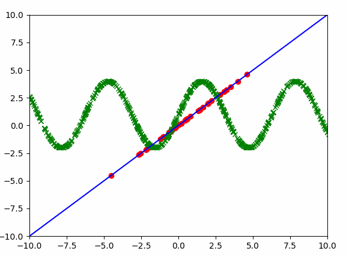

### Piecewise Linear Functions (PWL) implementation in PyTorch

Piecewise Linear Functions (PWLs) can be used to approximate any 1D function. 
PWLs are built with a configurable number of line segments - the more segments the more accurate the approximation.
This package implements PWLs in PyTorch and as such you can optimize them using standard gradient descent
and even use them as the activation function in your neural nets. 

For example here you can see a PWL (blue) fitting to the dataset (green). Red dots are breakpoints - they connect separate PWL segments:


##### Installation:

`pip install torchpwl`

##### Example usage:

```python
import torchpwl

# Create a PWL consisting of 3 segments for 5 channels - each channel will have its own PWL function.
pwl = torchpwl.PWL(num_channels=5, num_breakpoints=3)
x = torch.Tensor(11, 5).normal_()
y = pwl(x)

```

Monotonicity is also supported via `MonoPWL`:

```python
# Create a PWL with monotonicity constraint (here increasing).
mono_increasing_pwl = torchpwl.MonoPWL(num_channels=5, num_breakpoints=3, monotonicity=+1)
x = torch.Tensor(11, 5).normal_()
y = mono_increasing_pwl(x)
```

PWL classes learn the keypoint position on the `x` axis (see the gifs).
If you do not want to train the `x` coordinates of the PWL keypoints you can use the `Calibrator` class where the
keypoints are specified manually and they remain fixed (making training easier).

Adam optimizer (lr anywhare between 1e-4 to 1e-1) is recommended for training as the gradients are scaled to the
 appropriate values automatically (parameters have operating range of ~1).

See the class documentations for more details.

##### More examples:

Below you can see a PWL fitting to the sine. 


See the examples/gif directory for more examples.

##### Performance

The PWL is of course slower than RELU, but the implementation is relatively efficient. The performance is proportional to `log(num_keypoints)*batch_size + num_keypoints`.
Given that the batch size is much larger than the number of the keypoints, the performance of the PWL is proportional to 
the `log(num_keypoints)` due to the use of binary search.  

